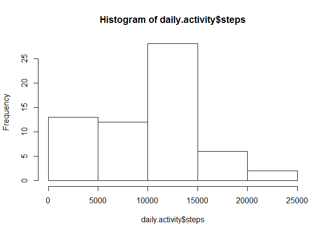
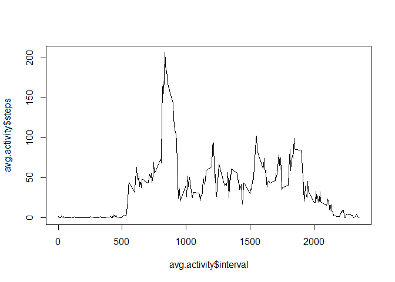
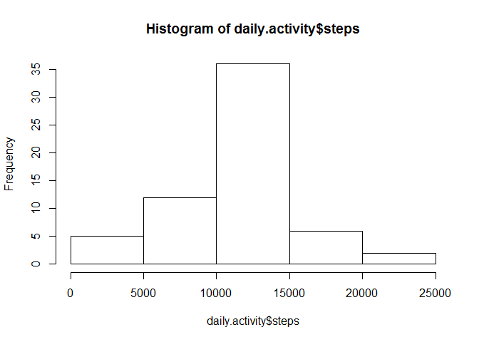
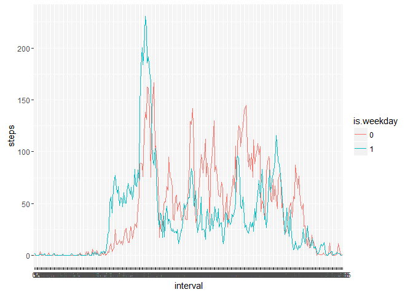

# Reproducible Research: Peer Assessment 1

This document includes the code and figures used to analyze the activity data set, which includes information about the number of steps taken by a single subject throughout the day in five-minute intervals.

In this analysis, we will:

* Load and preprocess the data
* Examine the number of steps taken per day
* Examine the pattern of steps thoughout the day
* Impute the missing values of the data set
* Examine the difference in the patter of steps taken throughout the day for weekdays vs weekends

## Loading and preprocessing the data

```r
require(ggplot2)
```

```
## Loading required package: ggplot2
```

```r
activity<-read.csv(unz('activity.zip','activity.csv'), header=T)
activity$date<- as.Date(activity$date)
```


## What is mean total number of steps taken per day?

```r
daily.activity<- aggregate(activity$steps,by=list(date=activity$date), FUN=sum, na.rm=T)
names(daily.activity)<- c('date','steps')

hist(daily.activity$steps)
```

 

```r
meansteps<-mean(daily.activity$steps, na.rm=T)
mediansteps<-median(daily.activity$steps, na.rm=T)
```

The mean steps per day is 9354.2295082.
The median steps per day is 10395.


## What is the average daily activity pattern?

```r
avg.activity<- aggregate(activity$steps,by=list(interval=activity$interval), FUN=mean, na.rm=T)
names(avg.activity)<-c('interval','steps')
plot(avg.activity$steps ~ avg.activity$interval, type='l')
```

 

```r
max.steps.inteval<-head(avg.activity[order(avg.activity$steps, na.last = T, decreasing=T),1],1)
```

The interval with the highest number of steps is at 835 minutes.

## Imputing missing values

```r
na.count<-sum(is.na(activity$steps))
joined.activity<- merge(activity,avg.activity, by='interval')
joined.activity$steps<-ifelse(is.na(joined.activity$steps.x),joined.activity$steps.y,
                              joined.activity$steps.x)
imputed.activity<-joined.activity[,c(1,3,5)]

daily.activity<- aggregate(imputed.activity$steps,by=list(date=imputed.activity$date), FUN=sum, na.rm=T)
names(daily.activity)<- c('date','steps')
hist(daily.activity$steps)
```

 

```r
meansteps<-mean(daily.activity$steps, na.rm=T)
mediansteps<-median(daily.activity$steps, na.rm=T)
```

There were 2304 missing values in the data set.

Once missing values are imputed, the mean steps/day is 10766.19, and the median is 10766.19. Imputing the missing values caused only small changes in the mean and median.

## Are there differences in activity patterns between weekdays and weekends?

```r
imputed.activity$dayname<-weekdays(imputed.activity$date, abbreviate=T) 
imputed.activity$is.weekday<-factor(ifelse(imputed.activity$dayname == 'Sat' |
                                    imputed.activity$dayname == 'Sun',0,1))
imputed.activity$interval<-factor(imputed.activity$interval)

avg.activity<- aggregate(imputed.activity$steps,by=list(interval=imputed.activity$interval, is.weekday=imputed.activity$is.weekday), FUN=mean, na.rm=T)
names(avg.activity)<-c('interval','is.weekday','steps')

ggplot(data=avg.activity, aes(x=interval,y=steps, group=is.weekday)) + geom_line(aes(color=is.weekday)) 
```

 

Weekdays and weekends have a number of significant differences in their pattern of steps/day. Many of these can intuitively be explained based on the subject working in an office environment on weekdays but not on weekends. 

Some examples of this include:

* Weekdays have a larger activity peak at mid-day, which is consistent with a lunch break in an office
* Weekdays ramp up the number of steps earlier in the day, suggesting the subject is getting up early for work on weekdays, and sleeping in on weekends.
* Steps are lower through the afternoon on weekdays, which is consistent with the subject sitting at a desk in the office

